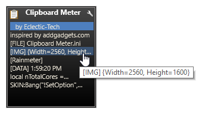

# Clipboard Meter
**Clipboard Meter Gadget inspired by the well-known AddGadgets.com Windows Sidebar gadgets.**

The Clipboard Meter Gadget is a collaboration between [Eclectic-Tech](https://eclectic-tech.deviantart.com) and myself, based on his [Illustro Clipboard+](http://fav.me/daoug6l) skin with styling to match the [Gadgets](https://github.com/SilverAzide/Gadgets) suite.

[![Rainmeter Forum](https://img.shields.io/static/v1?label=Rainmeter%20Forum&message=Clipboard%20Meter&colorA=f0f0f0&colorB=2a6e9b&style=for-the-badge&logo=data%3Aimage%2Fpng%3Bbase64%2CiVBORw0KGgoAAAANSUhEUgAAAAsAAAAQCAYAAADAvYV%2BAAAABHNCSVQICAgIfAhkiAAAAAlwSFlzAAAESwAABEsBbzH2CgAAABl0RVh0U29mdHdhcmUAd3d3Lmlua3NjYXBlLm9yZ5vuPBoAAAH6SURBVCiRhdJPSJNhHAfw7%2FO8z%2Fu8%2F3w3bW05WVlr4XRzyw0iFRfF7FIepD8UQn9Mq8MWBnXpsPDapVuhyyKKqE4lHSoKqUPUwYQkgkqtiBAcCTU22db7dLFyueh3%2FPHh%2B%2BUHP6DCNCTS6yrt6d8LX%2FKyU2HSS39iqPm%2F2KXLF7aHvKajSr8BCPJPHDwx3GbT1c4z3TGpub62PnLq6qHKeM9tydS0a6ldW%2ByUEJze2W5yKp3bOHClehmOrM72tW7wOJs8TgCAw9Swvz1oU7g0WIajR4dkzthgfzxqLq3d1xbkFDgQOn7R9RtbVXJfrHGt7q4us1Bkhp6OsG7YjdQiFoQzluqPR8rlr1M2N3EI9PiS123Un0zH%2FHUOvlLnKH5%2BCuvbp2XpnWGfrEuFvUzjfNvWgLcm%2FyyFwtQdAAR8fRfUyACo4YY1%2FxaxBo8x9npmB5MAVZYoIbK2mCVQmBpFYfoeqOEGkRSwlhGACJXmiqWHD169n1eCvSDc9qdfWLCyX6C2JPB4ciaXzRdGpbkXdz%2Fooee77XaXK9RxmArLAmEq2KootNazmMh7xcjY%2BGwmI44QAAicvLTC5PxReE2tt3tTo72uxkTmew73J95ln7z5OJcrleKT53unlzyKIIFEusthMw5aQtRTgtmv2YVbysKPm%2BPDx4oA8BMJrI6FKL9sKAAAAABJRU5ErkJggg%3D%3D)](https://forum.rainmeter.net/viewtopic.php?f=27&t=26876)

**NOTE:** 
The installer is in the form of a patch, which will patch your existing [Gadgets](https://github.com/SilverAzide/Gadgets) installation without affecting your existing configuration or layouts. If you don't have the Gadgets suite installed, this will install as a standalone skin.

## Features
* Manages up to 10 items copied to your clipboard.
* Supports text, images, files, and data.
* Left-click a clip to move it to the top of the stack and onto your Windows clipboard, then paste it where you want.
* Middle-click any unselected clip to delete it from the stack.
* Double-click the clipboard icon to clear all clips and your Windows clipboard.
* Allows setting to topmost window position.
* Configurable tooltips show the text of multi-line clips.
* Scales to any desired size.

## Requirements
Rainmeter 4.3.1 or later: <https://www.rainmeter.net>. 

## Attribution
* [ClipboardPlugin](https://forum.rainmeter.net/viewtopic.php?p=112095#p112095) by [Evgenii Vilkov](https://zzeneg.deviantart.com).
* [Illustro Clipboard+](http://fav.me/daoug6l) by [Eclectic-Tech](https://eclectic-tech.deviantart.com).
* [Gadgets](https://github.com/SilverAzide/Gadgets) by [SilverAzide](https://github.com/SilverAzide).

## License
Creative Commons Attribution-Noncommercial-Share Alike 3.0 License

---

